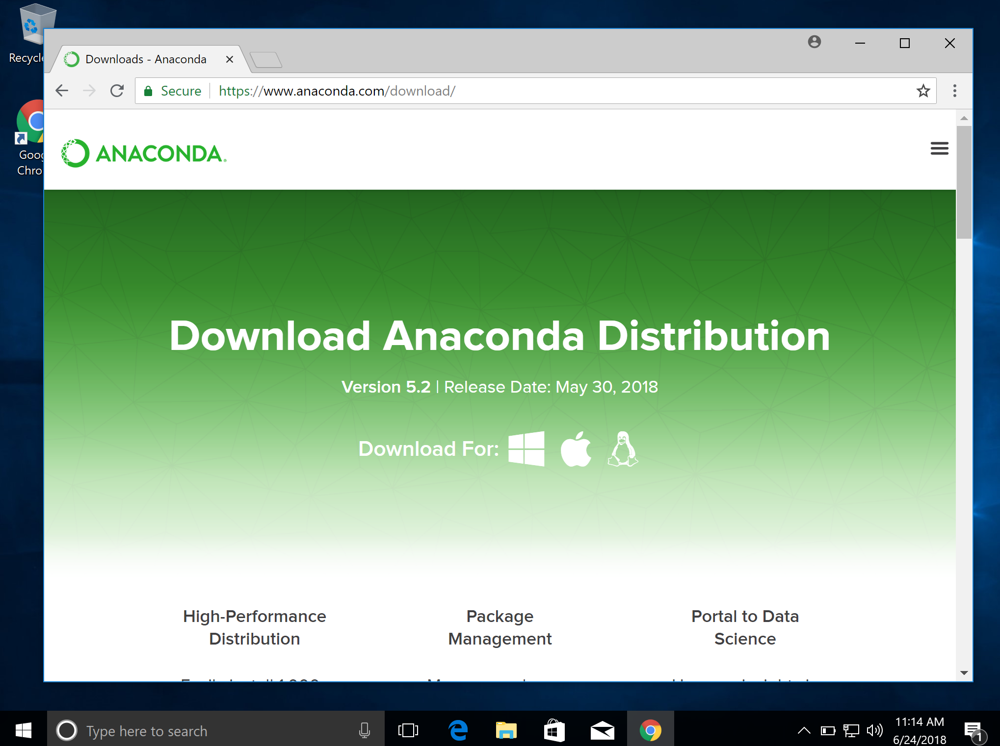
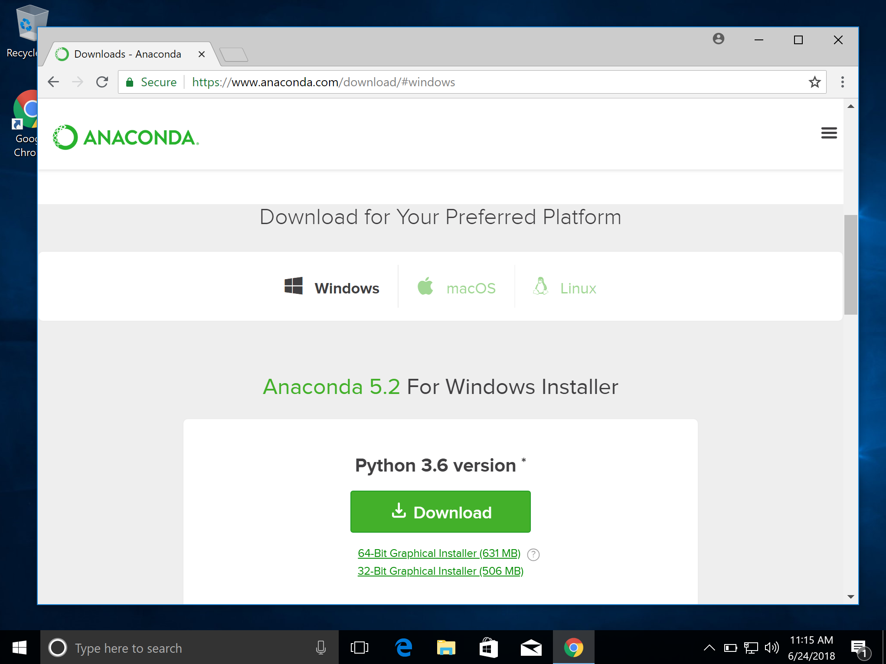
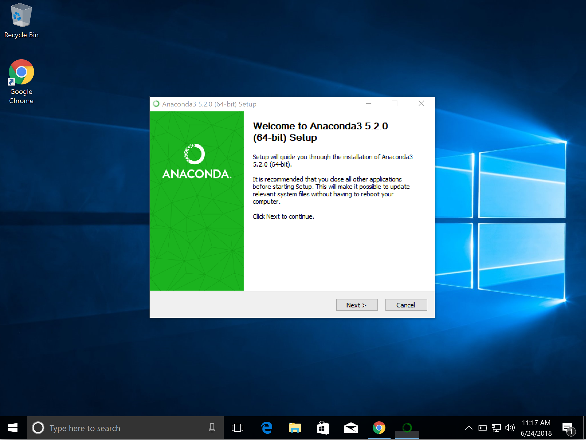
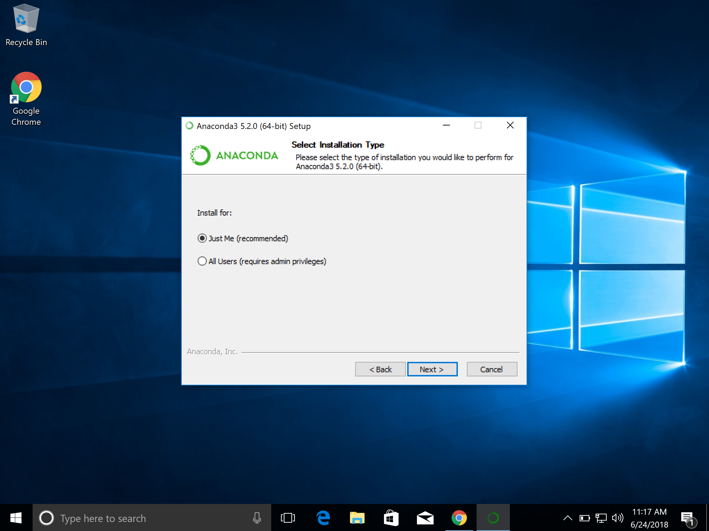
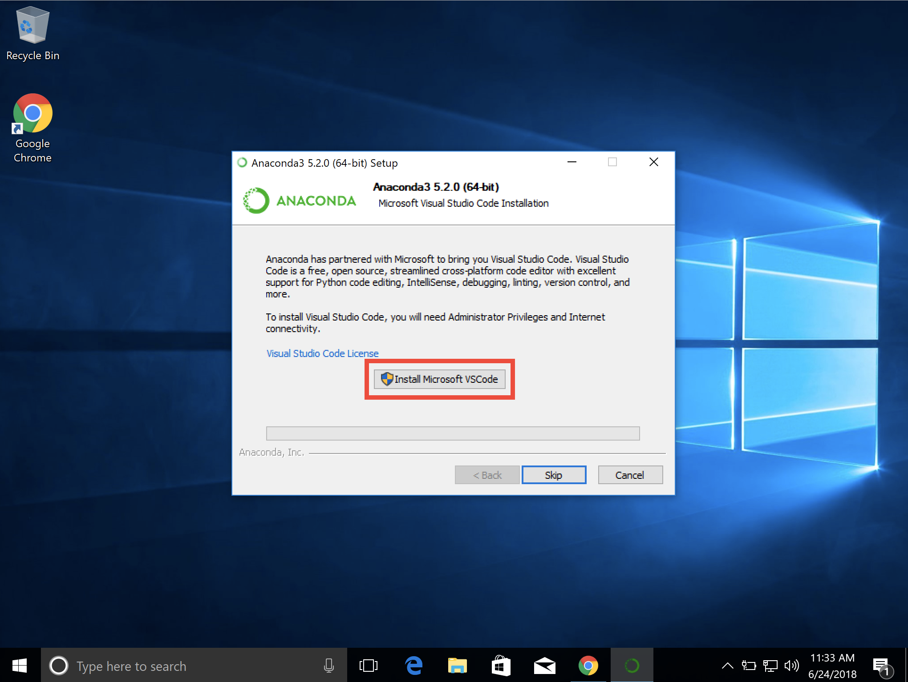
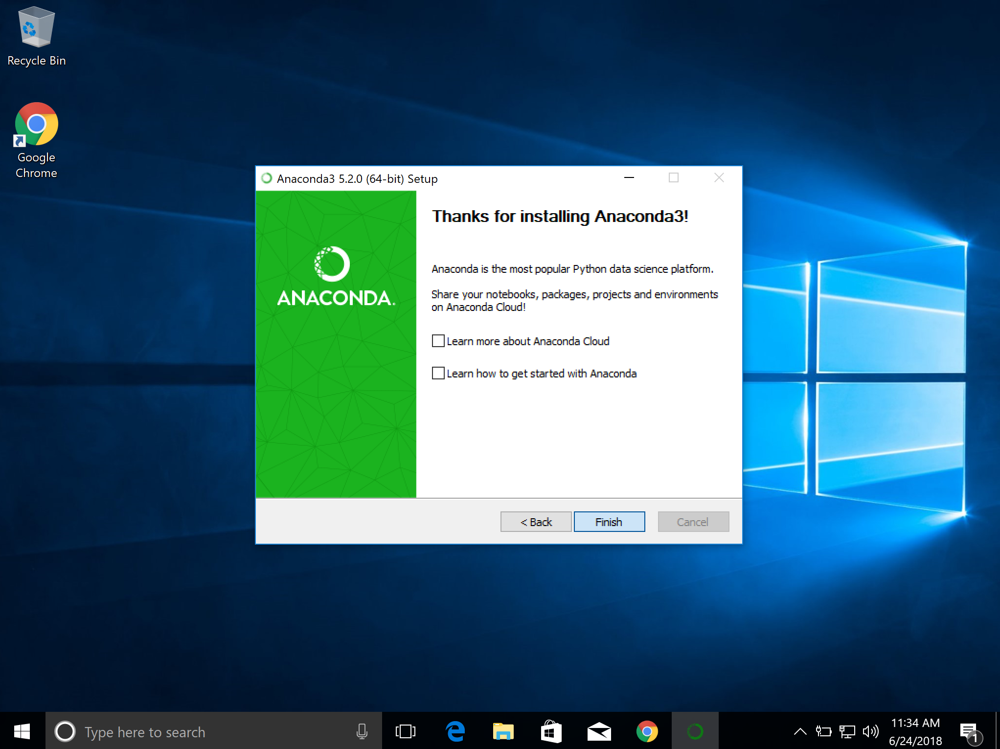
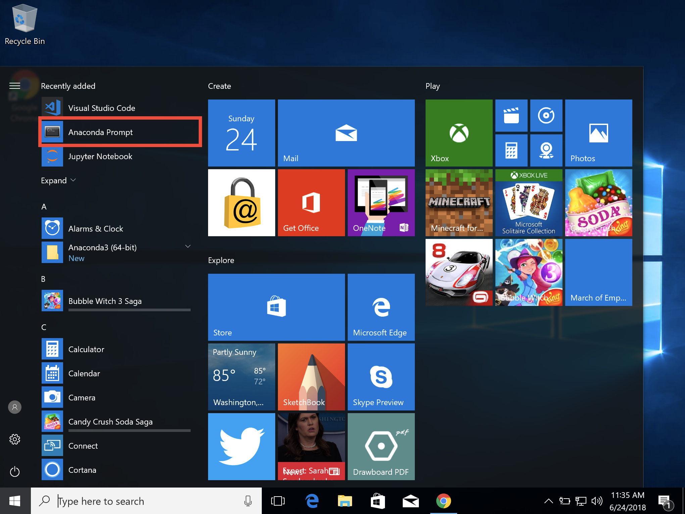
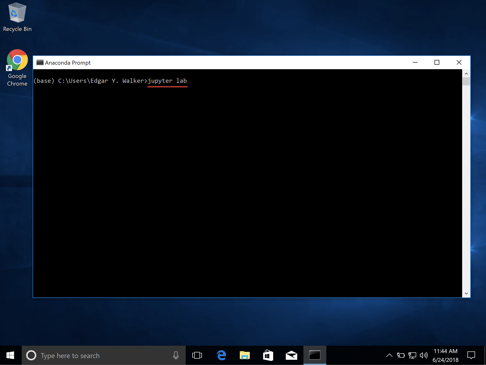
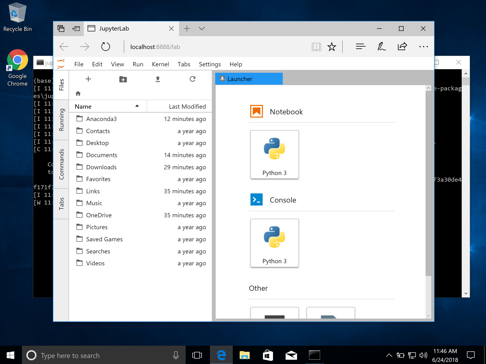

# Installing Python on Windows with Anaconda

It turns out that there is more than one way to install Python on Windows. While there are pros and cons for each method, if you are just starting out with Python for scientific computation, I highly recommend that you start out with [Anaconda](https://www.anaconda.com). Anaconda distribution bundles together the Python interpreter (the piece of software you will use to run Python code) with many scientific computation Python packages that are considered essential. Here, I provide a step-by-step instructions for installing Python along with essential scientific computing packages and a text editor all through the installation of Anaconda. Let's get started!

### Windows version

All installation instructions and screen shots are based on Windows 10, and you may find that you have to adjust the instructions slightly to work with the older versions of Windows.

### Need help?

I highly recommend that you try to follow this instruction closely and see if you can figure out any issue that arise. Due to the large variation in computer system configurations, no instruction is really perfect, and being able to figure out quirks in the instructions and finding your own solution would become vital skill in computer programming in general! However, knowing when to turn for help is just as essential of a skill, so if you get really stuck, then you can always contact me for help!

## 1. Downloading Anaconda

Visit https://www.anaconda.com/download/. Click on the Windows logo by `Download For`:

At the bottom of the page, hit "Download" for **Python 3.6** (not Python 2.7!). Wait for the download to complete.

## 2. Installing Anaconda Distribution

Once the installer completes downloading, launch the installer.

You can hit Next to proceed through the installation, **keeping the default recommended options**.

After a couple screens, Anaconda starts installing. Go ahead and grab a cup (or two) coffee - the installation can take some time to complete.

### Installing Visual Studio Code (VSCode)

Once the installation completes, Anaconda will offer to install [Visual Studio Code](https://code.visualstudio.com/) - a coding text editor filled with a lot of features useful for programming. Unless you already have a text editor of your choice (e.g. vim, emacs, Atom, Brackets, etc.), **I strongly recommend that you install Visual Studio Code** at this step. 

If you decide to install it,  hit "Install Microsoft VSCode" button and follow the instructions on the installation screen to complete the installation. If you don't want to install VSCode now, you can always visit VSCode website https://code.visualstudio.com to download and install it at a later time.

If everything goes well, the Anaconda distribution installation should complete without an issue! Hit "Finish" to exit out of the installation.

## 3. Checking Anaconda Installation

To verify the Anaconda installation, let's go ahead and learn to launch Jupyter Lab environment. To do so, we are going to launch `Anaconda prompt`. Open up the start menu (the bottom left Windows icon), and find the `Anaconda prompt` - click on it to launch.

Anaconda prompt launches a customized **command prompt** from which you can execute Python scripts, install Python packages, and launch tools like Jupyter Lab. It may not be the most visually appealing piece of software, but you will gain a lot by learning to be a bit familiar with it. To launch Jupyter Lab, simply type in `jupyter lab` in the command prompt, and hit `Enter` (you may have to hit Enter a few times on the very first launch).

This should launch a web browser, and take you the Jupyter Lab top page.

If you got this far, then congratulations! You have successfully installed and verified your Anaconda distribution, and you are now ready for Python workshop week 2 and beyond. 